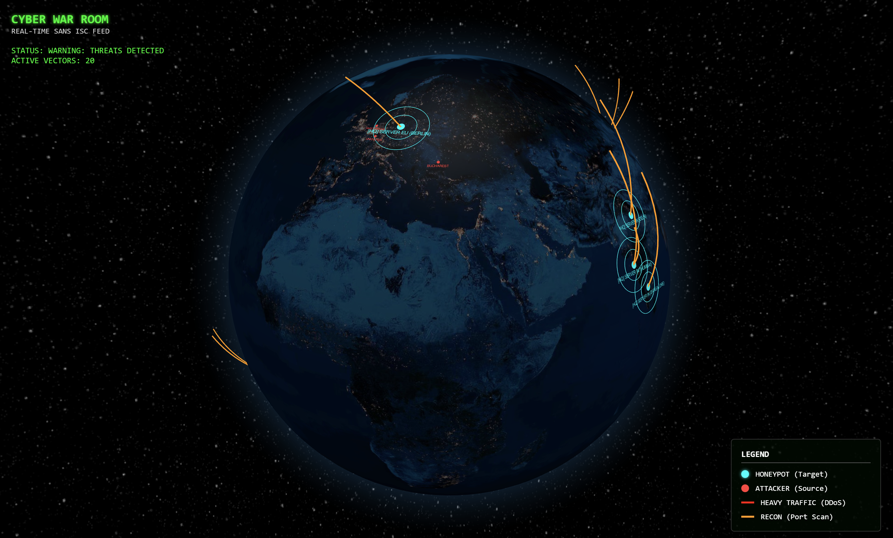

# 🌍 Global Cyber Threat Monitor (3D)

> *"Visualizing the invisible war happening on the internet — right now."*



---

## 📖 Table of Contents

- [The Story](#-the-story--wait-can-i-see-that-live)
- [The Challenge](#-the-challenge--where-is-the-data)
- [Tech Stack & Architecture](#️-tech-stack--architecture)
- [Computer Science Concepts Used](#-computer-science-concepts-used)
- [How to Run the Project](#-how-to-run-the-project)
- [Future Improvements](#-future-improvements)
- [Acknowledgments](#-acknowledgments)

---

## ⚡ The Story — *"Wait… can I see that live?"*

This project started during a late-night YouTube rabbit hole.  
I was watching an [IBM video](https://youtu.be/z503nLsfe5s) explaining **DDoS (Distributed Denial of Service)** attacks — botnets, zombie machines, traffic floods, and how entire services can be knocked offline.

The explanations were clear, but abstract.

I kept thinking:

> *"What If we can see it all Live!"*

That curiosity led to the idea of building a **cyber-war room style visualization** — a real-time, global, 3D map of ongoing cyber threats.

This project is the result.

---

## 🚧 The Challenge — *"Where is the data?"*

The first assumption was naive:

> *"I'll just stream live attack data from the internet."*

Reality hit quickly:

1. **Live attack data is highly sensitive** — companies do not expose it publicly.
2. **Packet sniffing at scale** requires massive infrastructure and permissions.
3. Exposing real victim data would be unethical and illegal.

### 🔁 The Pivot

Instead of raw live traffic, I discovered the  
**SANS Internet Storm Center (ISC)** Threat Feed.

SANS collects data from **global honeypots** and publishes:
- Top attacking IPs
- Attack counts
- Update intervals of a few minutes

This changed the engineering problem:

| Before | After |
|------|------|
| Live packet streaming | Periodic threat polling |
| Infinite data firehose | Controlled, ethical data source |
| Direct visualization | Simulated real-time flow |

---

## 🛠️ Tech Stack & Architecture

The system follows a **Producer–Consumer architecture**.

### 🧠 Backend — *The Command Center*

- **Node.js + Express** — Central intelligence hub  
- **Axios** — Polls the SANS ISC threat feed every 60 seconds  
- **GeoIP-Lite** — Converts IPs to geographic coordinates (O(1) lookup)  
- **Socket.io** — Real-time broadcasting to connected clients  

📡 The backend collects, enriches, buffers, and streams threat intelligence.

### 🎨 Frontend — *The War Room*

- **React.js** — State management & live updates  
- **Globe.gl (Three.js / WebGL)** — 3D Earth with animated attack vectors  

Each arc represents:
- Source: Attacking IP (GeoIP-based)
- Destination: Simulated honeypot target
- Intensity: Derived from attack metrics

---

## 🎓 Computer Science Concepts Used

This project applies real engineering principles — not just visuals.

### 1️⃣ Polling vs WebSockets

**Problem:**  
The SANS API is REST-based, but the UI needs real-time updates.

**Wrong approach:**  
Frontend polling every second → API bans + inefficiency.

**Solution:**  
- Backend polls slowly (every 60 seconds)
- Backend pushes updates instantly via WebSockets

✔ Decoupled architecture  
✔ Scalable  
✔ API-friendly  

### 2️⃣ Heuristic Attack Classification

Raw data gives numbers — not intent.

A heuristic model infers attack type:

| Attack Ratio (attacks : count) | Classification |
|-------------------------------|---------------|
| ~1:1 | Port Scan / Reconnaissance |
| ~1:50+ | DDoS / Brute-force Flood |

This turns raw metrics into meaningful insight.

### 3️⃣ Data Normalization & Enrichment (Mini ETL)

Raw IPs alone cannot be visualized.

**ETL Pipeline:**

1. **Extract** — Parse IPs & metrics from JSON  
2. **Transform** — GeoIP lookup → Latitude & Longitude  
3. **Load** — Inject simulated honeypot targets and vectors  

✔ Ethical  
✔ Scalable  
✔ Visually expressive  

---

## 🚀 How to Run the Project

### ✅ Prerequisites

- Node.js (v16+ recommended)
- npm

### 🔥 Step 1: Start the Backend

```bash
cd server
npm install
node index.js
```

Expected output:

```
🚀 COMMAND CENTER ACTIVE
```

### 🌐 Step 2: Start the Frontend

```bash
cd client
npm install
npm start
```

Open:

```
http://localhost:3000
```

---

## 🔮 Future Improvements

- 🕰️ Historical timeline (attack playback)
- 🔊 Sound alerts for large-scale DDoS events
- 🧠 Clickable attack details (ports, protocol)
- 🚦 Global DEFCON-style threat indicator

---

## 🤝 Acknowledgments

- **SANS Internet Storm Center (ISC)** — Open threat intelligence
- **Globe.gl** — 3D visualization engine
- **IBM** — Inspiration for the project

